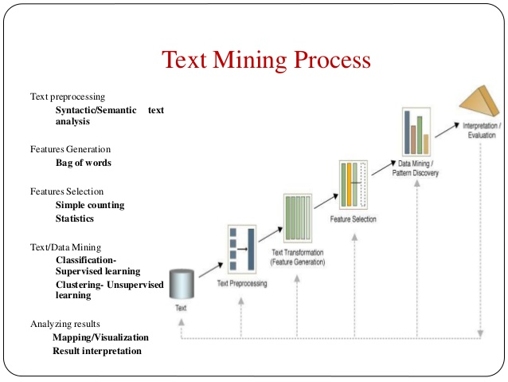

This projects shows how a natural language processing algorithm can be used to determine emails as spam or not spam. This is a type of supervised learning. The data is a text corpus of emails either labeled as spam or not spam. The text in the labeled emails provides the features to classify an email as spam or not spam.

Email consists of course of text. The differentiation between spam or not spam is made on basis of the words written in the email text. Not every word of course works as a feature. Some stop words like “is” or “there” maybe given in both emails. Only special kind of words are associated with spam or not spam. The words are the key unit used in the analysis by the algorithm. 

  

Words cannot be parsed in efficient way by computers. The algorithms need numbers for successful parsing. Words are therefore transformed into vectors in higher dimensional spaces. The length and direction of those vectors determines the vectors and the similarities between different vectors supports the assumption of relationships. Before a vector can be created from a word it is necessary to segment the text into words in a process of tokenization. After transformation different kind of feature selection techniques like counting or other statistics to make the association between the label and the word occurrences. The predictions are evaluated and the results interpreted.

 

 

